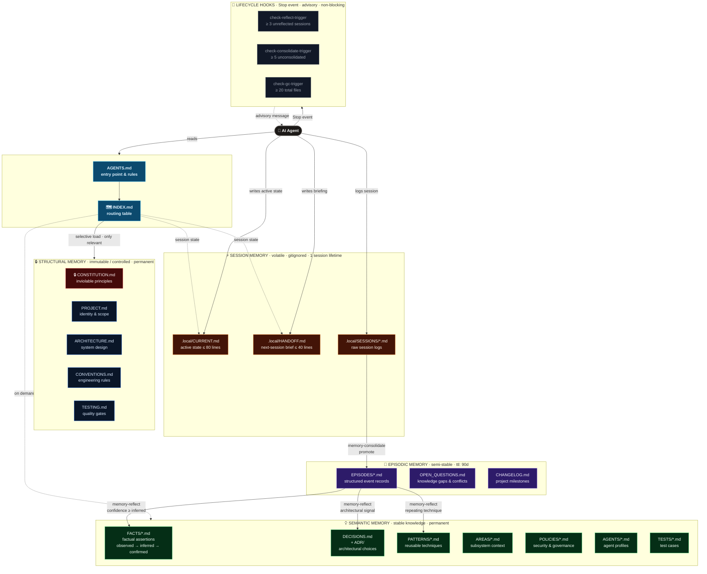
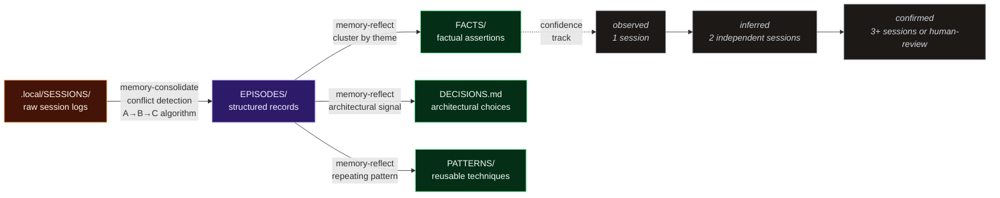
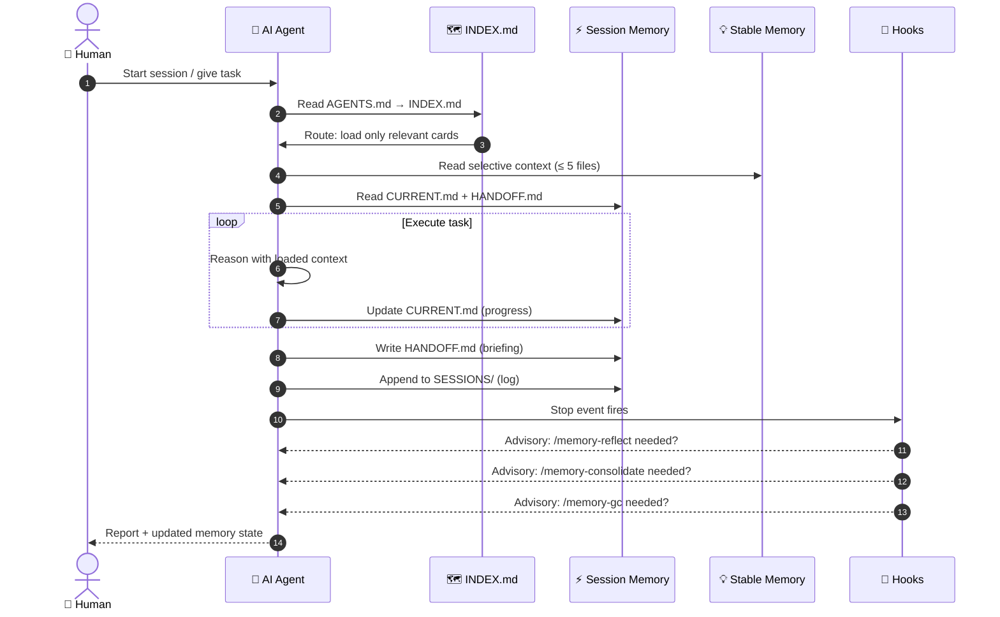
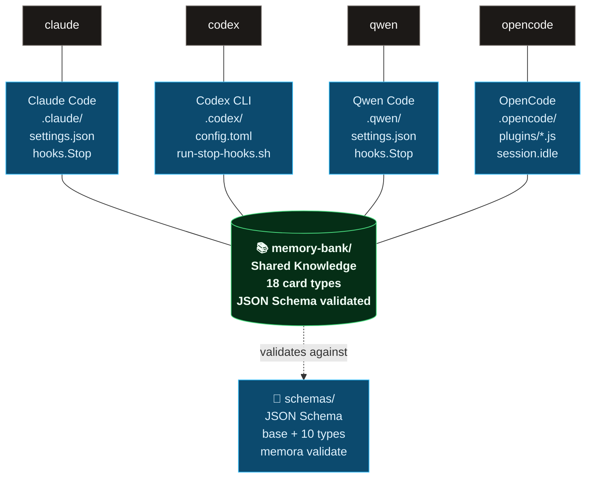

<div align="center">

# 🧠 Memora

**Memory architecture for AI coding agents**

[](https://opensource.org/licenses/MIT)
[](./AGENTS.md)
[](.)
[](.)

<p>
  <strong>Progressive context loading</strong> ·
  <strong>Canonical knowledge ownership</strong> ·
  <strong>Cross-tool compatibility</strong>
</p>

### Supported AI Toolchains

[](.)
[](.)
[](.)
[](.)

---

</div>

## 📌 Why Memora?

**Memora** transforms chaotic project context into a **managed, routable, and verifiable knowledge architecture** for AI agents.

Instead of loading the entire memory bank at startup, Memora uses **progressive disclosure**:

- **Agent** reads minimal required context
- **No duplicate facts** across files — canonical ownership
- **Predictable behavior** across different tools
- **Sustainable engineering memory**, not noise

> When AI agents work on long-lived projects, they need structured memory, not just context windows.

---

## 🎯 What is Memora?

A **cross-tool memory layer** for engineering repositories where AI agents work as **participants in long-lived development**, not stateless helpers.

### How It Works

```
Agent starts
    ↓
Reads: AGENTS.md
    ↓
Checks: memory-bank/INDEX.md
    ↓
Loads: Only relevant files
    ↓
Executes: Task
    ↓
Updates: CURRENT.md, HANDOFF.md
    ↓
Promotes: Durable insights → Stable files
```

### Three outcomes

- ⬇️ **Fewer tokens** in context
- ⬆️ **Consistent** responses
- ✨ **Better** long-term agent work

---

## 🔑 Core Principles

| Principle | Meaning |
|-----------|---------|
| 🎯 **Canonical ownership** | One fact lives in one place |
| 📦 **Progressive loading** | Load only what you need, budget by tokens |
| ⏰ **Temporal metadata** | Every fact has a verification date and confidence decay |
| 🔌 **Thin adapters** | Tool-specific files are adapters, not duplicates |
| 🔒 **Session isolation** | Session context lives in `.local/`, not mixed with stable knowledge |
| 📋 **Explicit decisions** | Architecture decisions go to `DECISIONS.md` + `ADR/` |
| 🛡️ **Privacy-first** | No secrets, tokens, or PII; three-zone privacy control |
| ⚖️ **Constitution-first** | All changes must respect `CONSTITUTION.md` |
| 🏷️ **Typed observations** | Every observation has a type × concept for routing |
| 🤖 **Agent-aware loading** | Context loading adapts to agent profile and token budget |

---

## 🏗️ Architecture

```
AGENTS.md (canonical instructions)
    ↓
memory-bank/INDEX.md (routing layer)
    ├→ PROJECT.md (identity & scope)
    ├→ ARCHITECTURE.md (system design)
    ├→ CONVENTIONS.md (engineering rules)
    ├→ TESTING.md (validation flow)
    ├→ DECISIONS.md + ADR/ (why decisions exist)
    ├→ AREAS/ (subsystem knowledge)
    ├→ PATTERNS/ (reusable techniques)
    ├→ FACTS/ · POLICIES/ · AGENTS/ · TESTS/ (new card types)
    ├→ .local/CURRENT.md (session state)
    └→ .local/HANDOFF.md (next-session briefing)
         ↓
    Promotion pipeline → stable files
```

---

## 🧠 Memory Architecture

### Four-Tier Memory Model

The core idea: **not all knowledge is equal**. Memora organizes memory into four tiers with different stability, lifetime, and trust levels. Knowledge flows upward through promotion — never backward.



---

### Card Type Ecosystem

Every piece of knowledge has a **canonical owner** — one card type that is authoritative for that fact. 18 card types cover the full spectrum of engineering memory.

| Tier | Card | Role | Authority | Default TTL |
|------|------|------|:---------:|:-----------:|
| 🔒 **Structural** | `CONSTITUTION.md` | Inviolable project principles | `immutable` | ∞ |
| 🔒 **Structural** | `PROJECT.md` | Identity, mission, domain vocabulary | `controlled` | ∞ |
| 🔒 **Structural** | `ARCHITECTURE.md` | System design, module map, data flows | `controlled` | ∞ |
| 🔒 **Structural** | `CONVENTIONS.md` | Code style, naming, git workflow | `controlled` | ∞ |
| 🔒 **Structural** | `TESTING.md` | Test strategy, CI, quality gates | `controlled` | ∞ |
| 💡 **Semantic** | `FACTS/*.md` | Verifiable factual assertions with provenance | `controlled` | ∞ |
| 💡 **Semantic** | `DECISIONS.md` | Architectural decision registry | `controlled` | ∞ |
| 💡 **Semantic** | `ADR/*.md` | Full context for each decision | `immutable` | ∞ |
| 💡 **Semantic** | `PATTERNS/*.md` | Reusable engineering techniques | `controlled` | ∞ |
| 💡 **Semantic** | `AREAS/*.md` | Subsystem-level context | `controlled` | ∞ |
| 💡 **Semantic** | `POLICIES/*.md` | Security & governance rules | `controlled` | ∞ |
| 💡 **Semantic** | `AGENTS/*.md` | AI agent profiles & capabilities | `controlled` | ∞ |
| 💡 **Semantic** | `TESTS/*.md` | Test cases with expected/actual results | `free` | ∞ |
| 📖 **Episodic** | `EPISODES/*.md` | Promoted, structured session records | `free` | 90d |
| 📖 **Episodic** | `OPEN_QUESTIONS.md` | Unresolved gaps & fact conflicts | `free` | ∞ |
| 📖 **Episodic** | `CHANGELOG.md` | Significant project milestones | `free` | ∞ |
| ⚡ **Session** | `.local/CURRENT.md` | Active work state (≤ 80 lines) | `free` | session |
| ⚡ **Session** | `.local/HANDOFF.md` | Next-session briefing (≤ 40 lines) | `free` | session |

Each card carries a typed front-matter with `id`, `type`, `version`, `pii_risk`, `ttl`, `tags` and `confidence` — validated by `memora validate`.

---

### Knowledge Promotion Pipeline

Raw observations in session logs are **promoted** upward through structured operations — never auto-written, always human-reviewable.



**Promotion rules:**
- `ADD` — new fact, no conflict detected
- `UPDATE` — new fact refines existing
- `CONFLICT` → frozen in `OPEN_QUESTIONS.md § Conflicts` — never auto-resolved
- `CONSTITUTION_CONFLICT` → blocked, requires human review + ADR

---

### Agent Session Lifecycle

From `memora init` to long-running project memory — a complete session flow:



---

### Multi-Toolchain Architecture

One memory bank, four toolchain adapters. All agents share the same `memory-bank/` — only the instruction format differs.



---

## 📂 Repository Structure

```
memora/
├── AGENTS.md                 # ⭐ Entry point for all agents
├── CLAUDE.md                 # Claude Code adapter
├── memory-bank/
│   ├── INDEX.md              # Routing table (what to read when)
│   ├── LIFECYCLE.md          # Memory operations & hooks flow
│   │
│   ├── ── 🔒 Structural Memory ──────────────────────────────────
│   ├── CONSTITUTION.md       # 🔒 Inviolable principles (immutable)
│   ├── PROJECT.md            # Identity, mission, domain vocabulary
│   ├── ARCHITECTURE.md       # System design & module map
│   ├── CONVENTIONS.md        # Code style & naming rules
│   ├── TESTING.md            # Test strategy & quality gates
│   │
│   ├── ── 💡 Semantic Memory ────────────────────────────────────
│   ├── FACTS/                # Factual assertions with confidence
│   ├── DECISIONS.md          # Architectural decision registry
│   ├── ADR/                  # Full decision records
│   ├── PATTERNS/             # Reusable engineering techniques
│   ├── AREAS/                # Subsystem-level knowledge
│   ├── POLICIES/             # Security & governance rules
│   ├── AGENTS/               # AI agent profiles & capabilities
│   ├── TESTS/                # Documented test cases
│   │
│   ├── ── 📖 Episodic Memory ────────────────────────────────────
│   ├── EPISODES/             # Promoted, structured session records
│   ├── OPEN_QUESTIONS.md     # Unresolved gaps & fact conflicts
│   ├── CHANGELOG.md          # Significant project milestones
│   │
│   ├── ── ⚡ Session Memory (gitignored) ──────────────────────
│   ├── .local/CURRENT.md     # Active state (≤ 80 lines)
│   ├── .local/HANDOFF.md     # Next-session briefing (≤ 40 lines)
│   ├── .local/SESSIONS/      # Raw session logs
│   └── ARCHIVE/              # Retired sessions
│
├── schemas/                  # JSON Schema for all 18 card types
├── .claude/                  # Claude Code integration
├── .codex/                   # Codex CLI integration
├── .qwen/                    # Qwen Code integration
├── .opencode/                # OpenCode integration
└── bin/memora.js             # CLI tool
```

---

## 🚀 Quick Start

### Prerequisites
- Node.js `>=16`
- `bash` (macOS/Linux; Windows: Git Bash/WSL)

### 1️⃣ Install CLI

```bash
npm install -g ./memora-cli-X.X.X.tgz
# or for development
npm link
```

> `npm install` automatically configures the pre-commit hook via the `prepare` script — no manual `git config` needed.

### 2️⃣ Bootstrap a New Project

```bash
memora init ./my-project
cd my-project
```

### 3️⃣ Verify Front-Matter

```bash
memora validate          # Core — must pass before first commit
memora validate --strict # Extended — all recommended fields
memora validate --watch  # Live reload during authoring
```

All files generated by `memora init` are valid out of the box.

### 4️⃣ Fill Core Context

Update these files with your project details:

- `memory-bank/PROJECT.md` — What is this project?
- `memory-bank/ARCHITECTURE.md` — How does it work?
- `memory-bank/TESTING.md` — How do we validate?
- `memory-bank/CONVENTIONS.md` — How do we write code?

### 5️⃣ Connect Your AI Tool

**Claude Code:**
```bash
claude .
```

**Codex CLI:**
```bash
codex --trust-project
```

**Qwen Code:**
Update `.qwen/settings.json` with `AGENTS.md` in context files.

---

## 🔒 Quality Gates

Memora ships with three layers of automated validation that enforce front-matter correctness across every workflow.

### Pre-commit hook

Activated automatically on `npm install`. Fires only when `memory-bank/*.md` files are staged — zero overhead otherwise.

```
git commit
    ↓
.githooks/pre-commit
    ↓
memora validate
    ↓
✓ pass → commit proceeds
✗ fail → commit blocked, fix instructions shown
```

Setup is automatic via the `prepare` script. To activate manually:

```bash
git config core.hooksPath .githooks
```

### GitHub Actions CI

Three jobs run on every push or pull request that touches `memory-bank/`, `schemas/`, or `bin/`:

| Job | Command | Blocks merge? |
|-----|---------|:-------------:|
| 🔍 Validate — Core | `memora validate` | ✅ Yes |
| 🔎 Validate — Extended | `memora validate --strict` | ❌ Advisory |
| 📝 Markdownlint | `markdownlint-cli2 **/*.md` | ✅ Yes |

The Extended job uploads a machine-readable JSON report as a CI artifact for every run.

### Local dev loop

```bash
# One-shot before commit
memora validate

# Continuous during authoring
memora validate --watch

# Full report for CI debugging
memora validate --format json
```

---

## 🧩 Knowledge Patterns

Six built-in patterns encode proven techniques for managing agent memory at scale.

### 🏷️ Observation Typing

Every observation is classified along **two dimensions**: `type` (what happened) × `concept` (what knowledge it encodes).

**6 observation types** route knowledge to the right owner:

| Type | Routes to |
|------|-----------|
| `bugfix` | `FACTS/`, `EPISODES/` |
| `feature` | `ARCHITECTURE.md`, `AREAS/` |
| `refactor` | `PATTERNS/`, `CONVENTIONS.md` |
| `discovery` | `FACTS/`, `OPEN_QUESTIONS.md` |
| `decision` | `DECISIONS.md`, `ADR/` |
| `incident` | `EPISODES/`, `OPEN_QUESTIONS.md` |

**7 observation concepts** clarify what kind of knowledge is captured: `how-it-works`, `why-it-exists`, `what-changed`, `problem-solution`, `gotcha`, `pattern`, `trade-off`.

### 🔐 Privacy Control

Three inline zones control how observations are stored:

```markdown
<private>...</private>           # Strip before saving — never persisted
<sensitive pii_risk="high">...   # Save with pii_risk: high, flag for review
<ephemeral>...</ephemeral>       # Session tier only — blocked from promotion
```

### 📉 Confidence Decay

Facts age. Memora tracks `last_verified` and automatically downgrades confidence:

| Confidence | Idle threshold | Downgrade to |
|------------|---------------|-------------|
| `confirmed` | 90 days | `inferred` |
| `inferred` | 60 days | `observed` |
| `observed` | 90 days | `STALE` → gc-candidate |

Reverification restores confidence based on the number of independent confirmations.

### 🤖 Agent Profiles

Five built-in profiles adapt observation focus and context loading per agent role:

| Profile | Observation types | Token budget | Restore layers |
|---------|------------------|:------------:|:--------------:|
| `full-stack-dev` | all 6 types | 8 000 | 1–3 |
| `architect` | feature, decision | 12 000 | 1–4 |
| `code-reviewer` | bugfix, refactor | 4 000 | 1–2 |
| `debugger` | bugfix, incident | 4 000 | 1–2 |
| `writer` | feature, discovery | 4 000 | 1–2 |

Set your profile in `AGENTS/<agent>.md`. Use `profile: "custom"` for manual configuration.

### 📐 Progressive Disclosure

Context is loaded in six layers with increasing cost. `memory-restore` stops when the token budget runs out:

| Layer | Content | ~Tokens | Load condition |
|-------|---------|:-------:|----------------|
| 1 | `.local/HANDOFF.md` | ~200 | Always |
| 2 | `.local/CURRENT.md` + `INDEX.md` | ~400 | Always |
| 3 | Canonical files (ARCHITECTURE, CONVENTIONS…) | ~800–2 000 | Per task |
| 4 | `FACTS/*.md` + `DECISIONS.md` (relevant) | ~400–1 000 | Per task |
| 5 | `EPISODES/*.md` (last 3) + `PATTERNS/*.md` | ~600–1 500 | On request |
| 6 | Full `SESSIONS/*.md` scan | ~1 000–3 000 | reflect/consolidate only |

Token budget formula: `estimated_tokens ≈ total_chars / 4`. Every restore ends with a token economics report.

### 🔍 Provenance Standard

Every promoted fact carries a provenance marker:

```markdown
<!-- prov: 2026-03-23 | conf: confirmed | src: session/2026-03-23 -->
```

Provenance is tracked at three levels: file-level (YAML front-matter), fact-level (inline annotations), and decision-level (reviewer tables).

---

## 🛠️ Memory Skills

Memora includes **8 operational skills** to maintain memory integrity:

### 🔧 `memory-bootstrap`
**First-run initialization** — Explores your project and fills `PROJECT.md`, `ARCHITECTURE.md`, etc.
- Run once after `memora init`
- Auto-detects stack, modules, tests
- Proposes `CONSTITUTION.md` principles for human review
- Creates an agent profile in `AGENTS/<agent>.md`

### 🔄 `memory-restore`
**Session start** — Restores context using budget-aware layered loading
- Reads `HANDOFF.md` + `CURRENT.md` (Layers 1–2, always)
- Loads additional layers based on agent profile and remaining token budget
- Prints a token economics report: `Budget / Loaded / Remaining / Layers`
- Falls back to `/memory-bootstrap` if memory is empty

### 📝 `update-memory`
**Session finalization** — Updates after task completion
- Runs privacy scan (strips `<private>`, flags `<sensitive>`, blocks `<ephemeral>` from promotion)
- Refreshes `CURRENT.md` and `HANDOFF.md` (7-field structured contract)
- Promotes durable insights to `DECISIONS.md`, `PATTERNS/` with `observation_type` and `concepts`

### 🔍 `memory-audit`
**Integrity check** — Weekly or before major tasks
- 11 checks: stale verifications, architectural drift, orphaned decisions, credential leaks
- **New in v0.0.2**: Confidence Decay (#9), Privacy Leak Scan (#10), Token Economics Health (#11)

### 🔗 `memory-consolidate`
**Multi-session promotion** — Weekly or after several sessions
- Moves session notes → `EPISODES/`
- **3D conflict resolution**: confidence × recency × breadth — with auto-resolution and audit trail
- Frozen conflicts go to `OPEN_QUESTIONS.md § Conflicts`

### 🪞 `memory-reflect`
**Cross-session synthesis** — After ≥ 2 sessions, or after `memory-consolidate`
- Clusters sessions by theme using `concepts` as signal
- Runs privacy scan before promotion
- Synthesizes insights with confidence levels (`observed` / `inferred` / `confirmed`)
- Promotes confirmed patterns → `PATTERNS/` with full provenance
- Proposes recurring decisions → `DECISIONS.md` as `💡 Proposed`
- Never auto-writes `CONSTITUTION.md` — only surfaces candidates for human review

### 🧹 `memory-gc`
**Cleanup** — Monthly or when `SESSIONS/` > 20 files
- Archives old sessions; compacts `CURRENT.md`
- **New in v0.0.2**: removes stale FACTS with `confidence: observed` + `last_verified > 180d`

### ❓ `memory-clarify`
**Gap analysis** — When audit finds issues or before major features
- Analyzes missing knowledge and decision consistency
- Generates targeted questions for `OPEN_QUESTIONS.md`

---

## ⚡ Deterministic Hooks

Memora includes **event-driven hooks** that fire on agent lifecycle events. Hooks are deterministic (not LLM-dependent) and advisory (notify, don't block).

### How it works

```
Agent session ends (Stop event)
    ↓
Hook fires → check-reflect-trigger.sh
    ↓
Counts unreflected sessions
    ↓
If ≥ threshold (default: 3) → advisory message
```

### Cross-tool configuration

| Toolchain | Mechanism | Config file |
|---|---|---|
| Claude Code | Declarative lifecycle hook | `.claude/settings.json` |
| Codex CLI | Experimental hooks engine | `.codex/config.toml` |
| Qwen Code | Claude-like automation hooks | `.qwen/settings.json` |
| OpenCode | Plugin event handler (JS) | `.opencode/plugins/reflect-trigger.js` |

### Anti-double-reflection

Two idempotency barriers prevent duplicate work:
1. **Hook = trigger** — outputs advisory message, does not auto-execute
2. **Skill = executor** — `memory-reflect` Step 1 filters sessions already marked `<!-- reflected: -->`

### Customization

```bash
# Adjust threshold via environment variable
export REFLECT_THRESHOLD=5
```

---

## 📊 Compatibility Matrix

| Feature | Claude Code | Codex CLI | Qwen Code | OpenCode |
|---------|:----------:|:---------:|:---------:|:--------:|
| Instructions | `CLAUDE.md` | Native | `settings.json` | Native |
| Skills/Commands | `.claude/skills/` | `.codex/skills/` | `.qwen/agents/` | `.opencode/commands/` |
| Memory files | ✅ Shared | ✅ Shared | ✅ Shared | ✅ Shared |
| Security mode | `permissions.deny` | Sandbox | `.qwenignore` | Patterns |

---

## ⚡ Recommended Workflow

**First session:**
```
memora init → /memory-bootstrap → Execute work → /update-memory
```

**Every subsequent session:**
```
/memory-restore → Execute work → /update-memory
```

**During authoring (dev mode):**
```
memora validate --watch    # live front-matter feedback while editing memory-bank/
```

**Before every commit:**
```
memora validate            # auto-runs via pre-commit hook; also run manually
```

**Periodic maintenance:**
```
Weekly:  /memory-consolidate → (hook triggers /memory-reflect automatically)
Weekly:  /memory-audit
Monthly: /memory-gc
As needed: /memory-clarify
```

**Golden rule:** Don't load all memory bank. Load only what you need. Promote only durable knowledge.

---

## 🔐 Security First

Memora is designed with **memory hygiene by default**.

### Never stored

- 🚫 API keys
- 🚫 Access tokens
- 🚫 Passwords
- 🚫 Raw credentials
- 🚫 PII

### Instead, reference by name

```bash
$DATABASE_URL
$OPENAI_API_KEY
$JWT_SECRET
```

### Privacy zones

Use inline tags to control how sensitive content flows through the memory pipeline:

```markdown
<private>removed before any write</private>
<sensitive pii_risk="high">stored with review flag</sensitive>
<ephemeral>session only — blocked from promotion</ephemeral>
```

See [`PATTERNS/privacy-control.md`](./memory-bank/PATTERNS/privacy-control.md) and [`POLICIES/privacy-zones.md`](./memory-bank/POLICIES/privacy-zones.md) for the full governance model.

### Built-in safeguards

- `.claudeignore` blocks sensitive files from agent context
- `memory-audit` check #10 scans for credential patterns and privacy leaks
- `update-memory` runs a privacy scan before every promotion
- `CONSTITUTION.md` governs what can be recorded

---

## 🎓 Why This Works

### Predictability
Every knowledge class has an owner and clear read path

### Scalability
Handles growth in sessions, decisions, subsystems, and agents

### Compatibility
Same knowledge architecture works across AI toolchains

### Observability
`CURRENT.md`, `HANDOFF.md`, `SESSIONS/`, `DECISIONS.md` form an audit trail

### Context hygiene
Memora reduces noise and prevents instruction dilution

---

## 📋 Conformance Levels

Memora defines three progressive conformance levels. Each level is a strict superset of the previous.

| Level | Badge | Who needs it | What is checked |
|-------|-------|--------------|-----------------|
| **Core** |  | Every project | Required front-matter fields: `title`, `authority`, `status` |
| **Extended** |  | Team projects | Core + recommended fields: `id`, `type`, `version`, `pii_risk`, `ttl`, `tags` |
| **Enterprise** |  | Regulated / multi-agent | Extended + PII scan, provenance `<!-- prov: -->` markers, human-review signatures |

### Core (required — blocks CI)

```yaml
---
title: "Human-readable name"
authority: "controlled"   # controlled | immutable | free
status: "active"          # active | draft | deprecated | proposed | accepted | superseded
---
```

Validated by `memora validate` (default). Errors **block** merge via GitHub Actions.

### Extended (recommended — advisory)

All Core fields plus:

```yaml
id: "my-subsystem"              # URL-safe slug; unique within memory-bank
type: "AREA"                    # Card type enum (18 types)
version: "1.0.0"                # Semver
pii_risk: "none"                # none | low | medium | high
ttl: null                       # null = permanent; ISO date = expires; "90d" = episodic
tags: ["onboarding", "arch"]    # Free-form labels for search
```

Validated by `memora validate --strict`. Warnings become errors; CI reports advisory result without blocking.

### Enterprise (governance layer)

All Extended fields plus:

- **PII scan** — no raw personal data in any tier; `pii_risk: "high"` triggers mandatory review
- **Provenance markers** — every promoted fact must carry `<!-- prov: YYYY-MM-DD | conf: confirmed | src: session/episode-id -->`
- **Human-review signatures** — structural files (`CONSTITUTION.md`, `ADR/*.md`) require explicit sign-off before merge
- **Audit trail** — `CHANGELOG.md` entries for every structural change; `OPEN_QUESTIONS.md § Conflicts` for unresolved disputes

### Validation commands

```bash
# Core — run before every commit
memora validate

# Extended — run in CI (advisory)
memora validate --strict

# Machine-readable report (JSON)
memora validate --format json

# Live reload during authoring (dev mode)
memora validate --watch
```

---

## 📚 Documentation

- **[MANIFESTO.md](./docs/MANIFESTO.md)** — Open standard for agent markdown instructions
- **[AGENTS.md](./AGENTS.md)** — Bootstrap and operating rules
- **[HOOKS.md](./docs/HOOKS.md)** — Deterministic hooks: setup, testing, troubleshooting
- **[memory-bank/INDEX.md](./memory-bank/INDEX.md)** — Routing guide
- **[memory-bank/LIFECYCLE.md](./memory-bank/LIFECYCLE.md)** — Memory operations flow

### Knowledge Patterns

- **[PATTERNS/observation-typing.md](./memory-bank/PATTERNS/observation-typing.md)** — 6 types × 7 concepts classification matrix
- **[PATTERNS/privacy-control.md](./memory-bank/PATTERNS/privacy-control.md)** — Three-zone privacy control
- **[PATTERNS/confidence-decay.md](./memory-bank/PATTERNS/confidence-decay.md)** — Confidence downgrade and reverification
- **[PATTERNS/agent-profiles.md](./memory-bank/PATTERNS/agent-profiles.md)** — 5 built-in agent profiles
- **[PATTERNS/progressive-disclosure.md](./memory-bank/PATTERNS/progressive-disclosure.md)** — 6-layer context loading with token budget
- **[PATTERNS/provenance-standard.md](./memory-bank/PATTERNS/provenance-standard.md)** — Fact provenance and traceability

---

## 🗺️ Roadmap

- [x] Front-matter schema validation (`memora validate`)
- [x] GitHub Actions CI (Core blocking + Extended advisory + Markdownlint)
- [x] Pre-commit hook with auto-activation via `npm install`
- [x] Live validation (`memora validate --watch`)
- [x] Four-tier memory model documentation
- [x] Observation typing — 6 types × 7 concepts with canonical routing
- [x] Privacy control — `<private>` / `<sensitive>` / `<ephemeral>` zones
- [x] Confidence decay — multi-step downgrade with reverification
- [x] Agent profiles — 5 presets with `token_budget` and `restore_layers`
- [x] Progressive disclosure — 6-layer loading with token economics report
- [x] Provenance standard — file, fact, and decision-level traceability
- [x] 3D conflict resolution in `memory-consolidate`
- [x] `memory-audit` extended to 11 checks
- [ ] Temporal freshness checks — flag facts not verified in > 60 days
- [ ] Drift detection — warn when stable files diverge from active patterns
- [ ] Monorepo and multi-service templates
- [ ] Starter packs (TypeScript, Python, Go, Rust)
- [ ] Auto-generator from existing codebases
- [ ] Visual dashboard for memory health

---

## 📄 License

MIT — Use freely. See [LICENSE](./LICENSE) for details.

---

<div align="center">

**Memora** — Made with love in Russia ❤️ 

[Star on GitHub](https://github.com/) · [Read Manifesto](./MANIFESTO.md) · [Quick Start](#-quick-start)

</div>
